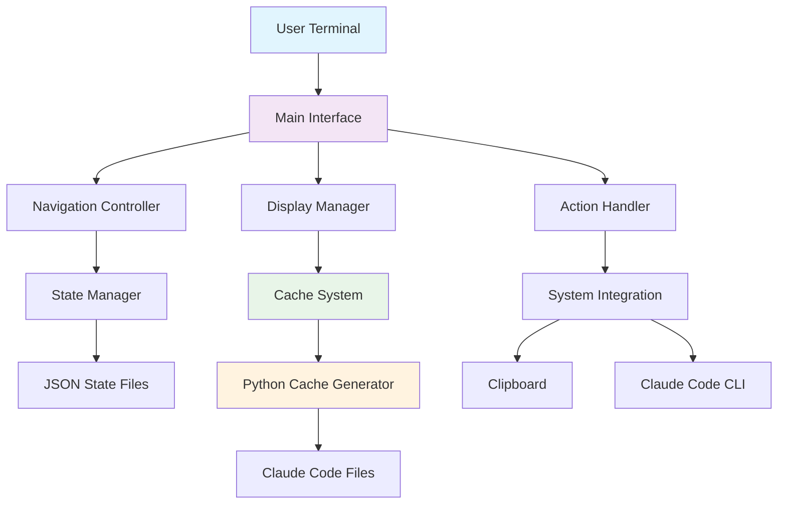

# 🏗️ CodeChats Manager Architecture

This document provides a detailed technical overview of the CodeChats Manager system architecture, implementation details, and design decisions.

## 📋 Table of Contents

- [System Overview](#system-overview)
- [Component Architecture](#component-architecture)
- [Data Flow](#data-flow)
- [File Structure](#file-structure)
- [Core Algorithms](#core-algorithms)
- [Performance Considerations](#performance-considerations)
- [Security Model](#security-model)
- [Extension Points](#extension-points)

## 🎯 System Overview

CodeChats Manager is a bash-based interactive interface for managing Claude Code conversation history. It provides a rich, navigational experience for users to explore, search, and resume their coding conversations.

### Design Principles

1. **Zero Dependencies on External Services**: All operations are local
2. **Performance First**: Smart caching with minimal overhead
3. **User Experience**: Intuitive navigation with visual feedback
4. **Cross-Platform**: Works on macOS, Linux, and WSL
5. **Non-Invasive**: Read-only access to Claude Code files
6. **Extensible**: Modular design for future enhancements

## 🧩 Component Architecture



### Core Components

#### 1. Main Interface (`codechats-main.sh`)
- **Responsibility**: Primary user interface and application orchestration
- **Technology**: Bash 4.0+ with advanced string manipulation
- **Key Features**:
  - Interactive menu system with letter-based navigation
  - Color-coded output using ANSI escape sequences
  - State persistence across sessions
  - Error handling and user feedback

#### 2. Cache System (`codechats-cache.py`)
- **Responsibility**: Conversation metadata extraction and indexing
- **Technology**: Python 3.6+ with standard library only
- **Key Features**:
  - JSONL file parsing with error tolerance
  - Content analysis for auto-tagging
  - Efficient metadata extraction
  - Character encoding normalization

#### 3. State Manager
- **Responsibility**: Navigation state persistence
- **Technology**: JSON-based state files
- **Key Features**:
  - Session state preservation
  - Navigation breadcrumbs
  - Temporary data management

#### 4. Integration Layer
- **Responsibility**: External system communication
- **Technology**: Shell command integration  
- **Key Features**:
  - Claude Code native commands (continueconversation)
  - System clipboard access (pbcopy/xclip)
  - File system monitoring

## 🔄 Data Flow

### 1. Initialization Flow

```
Start → Check Dependencies → Load State → Update Cache → Show Main Menu
```

#### Detailed Steps:
1. **Dependency Verification**: Check for `jq`, `python3`, and optional tools
2. **State Loading**: Read or create navigation state files
3. **Cache Validation**: Check cache age and trigger refresh if needed
4. **Interface Rendering**: Display main menu with current statistics

### 2. Cache Update Flow

```
Scan Projects → Parse JSONL → Extract Metadata → Analyze Content → Generate Cache
```

#### Cache Generation Process:
```python
for each .jsonl file in ~/.claude/projects:
    ├── Extract session_id from filename
    ├── Parse project path from directory structure
    ├── Read first/last messages for timestamps
    ├── Count total messages
    ├── Extract first user message for preview
    ├── Analyze content for auto-tagging
    └── Determine recency category
```

### 3. Navigation Flow

```
User Input → Validate Choice → Update State → Execute Action → Render Response
```

#### Navigation States:
- **Main Menu**: Project selection and global actions
- **Project View**: Conversation listing for specific project
- **Conversation Detail**: Individual conversation actions
- **Search Mode**: Cross-conversation search interface

### 4. Search Flow

```
User Query → Scan All Files → Extract Matches → Rank Results → Display Formatted
```

## 📁 File Structure

```
~/.claude/
├── projects/                    # Claude Code conversation storage
│   └── [encoded-project-path]/
│       └── [session-id].jsonl  # Individual conversation files
├── temp/                       # CodeChats Manager working directory
│   ├── codechats-main.sh      # Main application script
│   ├── codechats-cache.py     # Cache generation script
│   ├── codechats_cache.json   # Conversation metadata cache
│   ├── nav_state.json         # Navigation state persistence
│   ├── current_conversations.tmp  # Temporary selection data
│   ├── search_results.tmp     # Search result data
│   └── all_conversations.tmp  # Global conversation data
└── commands/                   # Global command links
    └── codechats -> ../temp/codechats-main.sh
```

### File Formats

#### Conversation Cache (`codechats_cache.json`)
```json
[
  {
    "session_id": "abc123def456",
    "project_path": "Users-maugus-projects-myapp",
    "timestamp": "2024-01-15T10:30:00Z",
    "duration_min": 45,
    "message_count": 28,
    "tools_count": 12,
    "first_message": "Help me implement user authentication",
    "tags": "architecture,debugging",
    "recency": "today"
  }
]
```

#### Navigation State (`nav_state.json`)
```json
{
  "level": "project",
  "selected_project": "Users-maugus-projects-myapp",
  "current_project": "/Users/maugus/projects/myapp"
}
```

## ⚙️ Core Algorithms

### 1. Project Path Encoding
Claude Code stores conversations in directories with encoded paths. We handle this with:

```bash
# Encoding: /Users/maugus/project → Users-maugus-project
get_current_project_encoded() {
    echo "$(pwd)" | sed 's|/|-|g' | sed 's|^-||'
}

# Decoding: Users-maugus-project → /Users/maugus/project
decode_project_path() {
    echo "$1" | sed 's|-|/|g'
}
```

### 2. Content Analysis for Auto-Tagging
```python
def analyze_content(file_content):
    tags = []
    content_lower = file_content.lower()
    
    tag_patterns = {
        'architecture': ['docagent', 'embedding', 'chunk', 'architecture'],
        'configuration': ['config', 'setup', 'claude', 'configuration'],
        'debugging': ['test', 'debug', 'error', 'failure'],
        'chat-system': ['chats', 'conversation', 'history']
    }
    
    for tag, keywords in tag_patterns.items():
        if any(keyword in content_lower for keyword in keywords):
            tags.append(tag)
    
    return tags
```

### 3. Recency Classification
```python
def determine_recency(timestamp):
    try:
        conv_date = datetime.fromisoformat(timestamp.replace('Z', '+00:00')).date()
        today = datetime.now().date()
        week_ago = today - timedelta(days=7)
        
        if conv_date == today:
            return 'today'
        elif conv_date >= week_ago:
            return 'week'
        else:
            return 'old'
    except:
        return 'old'
```

### 4. Smart Caching Strategy
```bash
# Cache refresh logic
if [ ! -f "$CONV_CACHE" ] || [ $(find "$CONV_CACHE" -mmin +60 | wc -l) -gt 0 ]; then
    update_cache
fi
```

## 🚀 Performance Considerations

### Cache Optimization
- **Selective Updates**: Only regenerate cache when files change
- **Incremental Processing**: Process only new/modified conversations
- **Memory Efficiency**: Stream processing for large conversation sets
- **Lazy Loading**: Load conversation content only when needed

### UI Responsiveness
- **Pagination**: Limit displayed items to prevent overwhelming output
- **Asynchronous Operations**: Background cache updates
- **Progressive Enhancement**: Core functionality works without optional dependencies

### File System Efficiency
- **Batch Operations**: Group file system calls
- **Path Optimization**: Use absolute paths to avoid directory traversal
- **Error Tolerance**: Continue operation when individual files fail

## 🔒 Security Model

### Access Control
- **Read-Only Operations**: Never modify Claude Code conversation files
- **Path Validation**: Ensure all file operations stay within expected directories
- **Input Sanitization**: Validate user input before file system operations
- **No Network Access**: All operations are local file system only

### Data Privacy
- **Local Processing**: All conversation analysis happens locally
- **No External Transmission**: Conversation content never leaves the system
- **Temporary Files**: Clean up temporary files after operations
- **Minimal Logging**: Only log operational information, never conversation content

### Error Handling
- **Graceful Degradation**: Continue operation when non-critical components fail
- **Safe Defaults**: Default to secure/conservative behavior
- **User Feedback**: Clear error messages without exposing system details

## 🔧 Extension Points

### 1. Additional Conversation Sources
The system can be extended to support other conversation storage formats:

```bash
# New parser function
parse_custom_format() {
    local file="$1"
    # Implementation for custom format
}
```

### 2. Enhanced Auto-Tagging
```python
# Plugin system for custom taggers
def register_custom_tagger(name, pattern_function):
    custom_taggers[name] = pattern_function

def apply_custom_taggers(content):
    tags = []
    for name, tagger in custom_taggers.items():
        if tagger(content):
            tags.append(name)
    return tags
```

### 3. Export Functionality
```bash
# Export conversations to different formats
export_conversations() {
    local format="$1"
    case "$format" in
        "markdown") export_to_markdown ;;
        "pdf") export_to_pdf ;;
        "json") export_to_json ;;
    esac
}
```

### 4. Integration Hooks
```bash
# Pre/post hooks for custom actions
run_pre_hook() {
    if [ -f ~/.claude/hooks/pre_codechats ]; then
        source ~/.claude/hooks/pre_codechats
    fi
}
```

## 📊 Monitoring and Diagnostics

### Performance Metrics
- Cache generation time
- File parsing success rate
- Search query performance
- User interaction patterns

### Debug Information
```bash
# Debug mode activation
DEBUG=1 codechats

# Debug output includes:
# - Cache generation timing
# - File parsing errors
# - Navigation state changes
# - Search query details
```

### Health Checks
```bash
# System health verification
codechats --health-check

# Checks:
# - Dependencies availability
# - File permissions
# - Cache consistency
# - Configuration validity
```

## 🎯 Future Enhancements

### Planned Features
1. **Conversation Analytics**: Usage patterns and insights
2. **Export Formats**: PDF, Markdown, HTML export options
3. **Custom Filters**: User-defined conversation filters
4. **Keyboard Shortcuts**: Improved navigation efficiency
5. **Theme Support**: Customizable color schemes
6. **Plugin System**: Third-party extension support

### Technical Improvements
1. **Async Processing**: Background operations for better responsiveness
2. **Incremental Updates**: Smarter cache invalidation
3. **Configuration Management**: User preference storage
4. **API Layer**: Programmatic access to conversation data

---

This architecture document serves as a reference for understanding the system's design and implementation. For development contributions or system modifications, please refer to this document to understand the current architecture and design patterns.